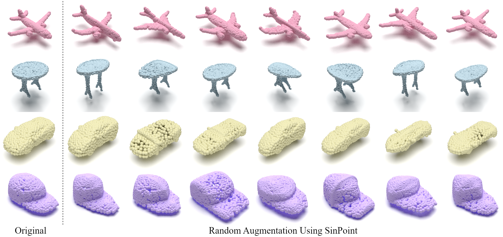

# SinPoint

<div align="center">
  
</div>

Augmented point clouds using SinPoint. In each row, the left-most sample is the original, and the remaining samples are its transformed results. Our SinPoint can generate high-fidelity and diverse data samples.


## Install

```bash
# Optional solution for step 2: install libs step by step
conda create -n SinPoint python=3.7 -y
conda activate SinPoint
conda install pytorch==1.10.1 torchvision==0.11.2 cudatoolkit=10.2 -c pytorch -y
pip install cycler einops h5py pyyaml==5.4.1 scikit-learn==0.24.2 scipy tqdm matplotlib==3.4.2
```


## Useage

### Classification ScanObjectNN

By default, it will create a fold named "checkpoints/{modelName}-{msg}-{randomseed}", which includes args.txt, best_checkpoint.pth, last_checkpoint.pth, log.txt, out.txt.
- Train SinPoint on code in original
```bash
# train SinPoint
python main.py --model DGCNN --msg test
# please add other paramemters as you wish.
```

- Train SinPoint on code in the supplementary material
```bash
# please modify the msg accrodingly
python main.py --model DGCNN --msg test
```

## Result

Below, we present the training results on code in original:

We train on NVIDIA TITAN RTX:

The best model trained achieved the following results on the validation set (also used as the test set):

++++++++++++++++Final results++++++++++++++++

++  Last Train time: 25 | Last Test time: 1  ++

++  Best Train loss: 1.225 | Best Test loss: 1.282  ++

++  Best Train acc_B: 93.477 | Best Test acc_B: 88.666  ++

++  Best Train acc: 93.945 | Best Test acc: 90.189  ++

++++++++++++++++++++++++++++++++++++++++

We train on RTX 3090:

The best model trained achieved the following results on the validation set (also used as the test set):

++++++++++++++++Final results++++++++++++++++

++  Last Train time: 21 | Last Test time: 1  ++

++  Best Train loss: 1.218 | Best Test loss: 1.283  ++

++  Best Train acc_B: 93.862 | Best Test acc_B: 89.024  ++

++  Best Train acc: 94.444 | Best Test acc: 90.017  ++

++++++++++++++++++++++++++++++++++++++++

We train on RTX 4090:

The best model trained achieved the following results on the validation set (also used as the test set):

++++++++++++++++Final results++++++++++++++++

++  Last Train time: 11 | Last Test time: 1  ++

++  Best Train loss: 1.223 | Best Test loss: 1.277  ++

++  Best Train acc_B: 94.287 | Best Test acc_B: 88.906  ++

++  Best Train acc: 94.705 | Best Test acc: 89.673  ++

++++++++++++++++++++++++++++++++++++++++

Below, we present the training results on code in the supplementary material:

We train on NVIDIA TITAN RTX:

The best model trained achieved the following results on the validation set (also used as the test set):

++++++++++++++++Final results++++++++++++++++

++  Last Train time: 24 | Last Test time: 1  ++

++  Best Train loss: 1.221 | Best Test loss: 1.278  ++

++  Best Train acc_B: 93.895 | Best Test acc_B: 89.174  ++

++  Best Train acc: 94.162 | Best Test acc: 90.189  ++

++++++++++++++++++++++++++++++++++++++++

We train on RTX 3090:

The best model trained achieved the following results on the validation set (also used as the test set):

++++++++++++++++Final results++++++++++++++++

++  Last Train time: 18 | Last Test time: 1  ++

++  Best Train loss: 1.24 | Best Test loss: 1.287  ++

++  Best Train acc_B: 92.368 | Best Test acc_B: 89.984  ++

++  Best Train acc: 93.294 | Best Test acc: 90.189  ++

++++++++++++++++++++++++++++++++++++++++

We train on RTX 4090:

The best model trained achieved the following results on the validation set (also used as the test set):

++++++++++++++++Final results++++++++++++++++

++  Last Train time: 12 | Last Test time: 1  ++

++  Best Train loss: 1.241 | Best Test loss: 1.286  ++

++  Best Train acc_B: 92.675 | Best Test acc_B: 89.085  ++

++  Best Train acc: 93.381 | Best Test acc: 89.501  ++

++++++++++++++++++++++++++++++++++++++++
